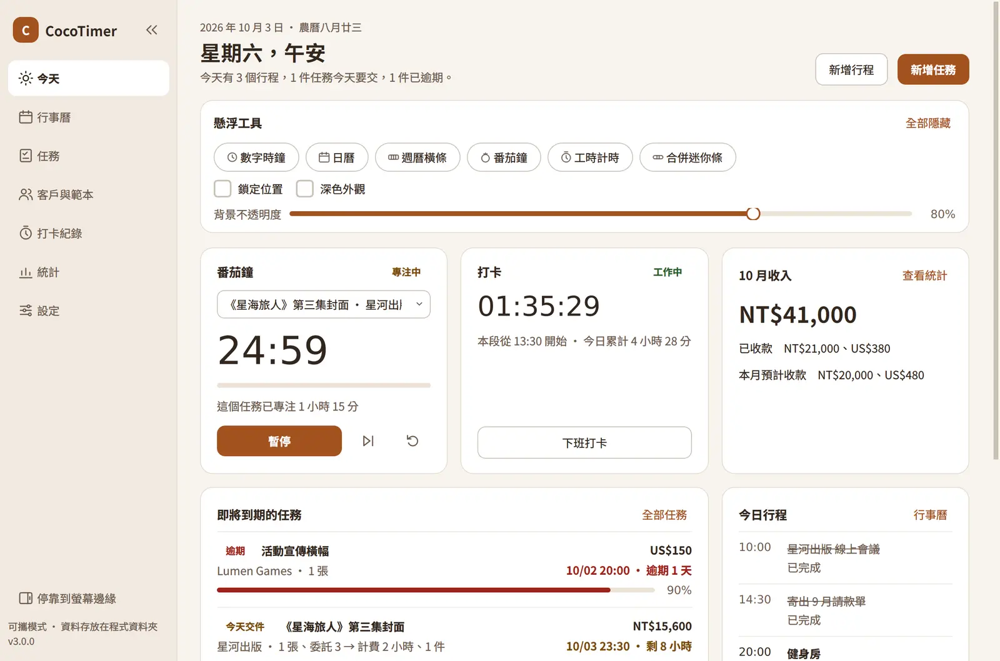
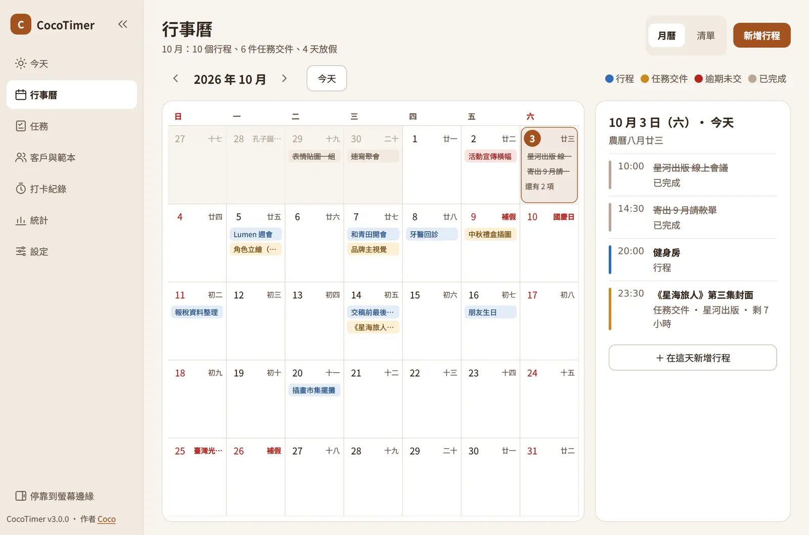
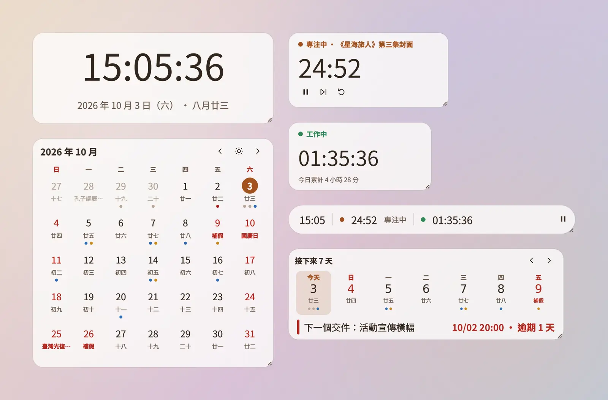

  

<h1 align="center">CocoTimer</h1>

  給接案者的 Windows 小工具：行事曆、任務與收款、番茄鐘和打卡，放在同一個小視窗裡。 
  <a href="https://chocochocococo.github.io/CocoTimer-Public/">官網</a> ·
  <a href="https://github.com/Chocochocococo/CocoTimer-Public/releases/latest">下載</a> ·
  <a href="https://chocochocococo.github.io/CocoTimer-Public/#demo">演示影片</a> ·
  <a href="https://chocochocococo.github.io/CocoTimer-Public/#changelog">更新記錄</a>

## 可以做什麼

- **今天**：打開就看到今天的行程、快到期的任務、番茄鐘、打卡和這個月的收入。
- **行事曆**：行程和任務交件日排在同一個月曆上，有農曆、國定假日、補假和補班日。
- **任務與收款**：記下單價和數量就算出總價，交件後自動算出結算日和預計收款日；可以一次把整批任務改成「已收款」。
- **客戶與範本**：每位客戶可以有自己的單價、幣別和結帳規則。
- **番茄鐘與打卡**：番茄鐘可以綁定任務，記錄每件案子花了多少時間。
- **統計**：按月、按年或一次看全部的收款和工時，匯出 Excel 或 CSV。
- **懸浮小工具**：時鐘、日曆、週曆、番茄鐘、工時，半透明放在桌面上。
- **側邊停靠**：收在螢幕邊緣，點一下就滑出來。
- **三種配色**：奶茶、經典和可可深色。

  
  

## 開始使用

1. 到[下載頁](https://github.com/Chocochocococo/CocoTimer-Public/releases/latest)下載最新版的 zip 檔。
2. 解壓縮到你喜歡的位置，打開 `CocoTimer.exe`。不用安裝。
3. 第一次開啟時，跟著引導選好常用幣別、結算方式和配色。之後都能在「設定」裡改。

需要 Windows 10 或 11。

## 資料放在哪裡

所有資料都存在程式旁邊的 `timemanager_data` 資料夾，每天自動備份一次。換電腦時，把整個 CocoTimer 資料夾帶走就好。

**從 v2 升級**：把舊版旁邊的 `timemanager_data` 資料夾複製到新版的 CocoTimer 資料夾裡，打開新版就會自動轉換。

## 一起做的夥伴

   v2 和 Gemini 一起做　
   v3 和 Claude 一起做

Gemini 是 Google 的商標，Claude 是 Anthropic 的商標。這裡的角色是同人風格的小插圖，不是官方圖示。

## 授權

可以自由使用（包括拿來管理自己的接案工作）、fork 和修改，也可以免費分享改過的版本；但不能把 CocoTimer 或改版拿去販售或做成收費服務。詳細條款見 [LICENSE](LICENSE)（MIT + Commons Clause）。

---

作者 [Coco](https://my-intro-website-production.up.railway.app/)
